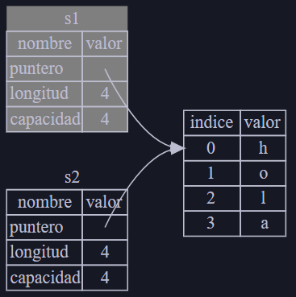

<style>
    .title1_color { color: #75C6FF }
    .title2_color { color: #B6D9A1 }
    .title3_color { color: #FEBB00 }

    .subrayar { text-decoration: underline; }

    table, th, td {
        border: 1px solid black;
    }
</style>

# <span class="title1_color">Ownership</span>

Permite a Rust hacer garantías de seguridad de memoria sin necesidad de un recolector de basura, por lo que es importante entender cómo funciona.

Características relacionadas: 
- Préstamo (borrowing)
- Slices
- Cómo Rust organiza los datos en la memoria

## <span class="title1_color">¿Qué es el Ownership?</span>

El ownership es un conjunto de reglas que definen cómo un programa de Rust administra la memoria.

En Rust la memoria se administra a través de un sistema de ownership con un conjunto de reglas que el compilador verifica. Si alguna de las reglas se viola, el programa no se compilará. Ninguna de las características del ownership ralentizará su programa mientras se ejecuta.

### El Stack y el Heap

Tanto el stack como el heap son partes de la memoria disponible para su código para usar en tiempo de ejecución. <span class="subrayar">**El stack**</span> almacena valores en el orden en que los recibe y elimina los valores en el orden opuesto. Esto se conoce como LIFO que es el acrónimo inglés de Last In, First Out o en español El último en entrar, es el primero en salir. Todos los datos almacenados en el stack deben tener un tamaño conocido y fijo. Los datos con un tamaño desconocido en tiempo de compilación o un tamaño que puede cambiar deben almacenarse en el heap en su lugar.

El heap es menos organizado: cuando coloca datos en el heap, solicita una cierta cantidad de espacio. El administrador de memoria encuentra un lugar vacío en el heap que sea lo suficientemente grande, lo marca como en uso y devuelve un <span class="title3_color">*puntero*</span>, que es la dirección de esa ubicación. Este proceso se llama *asignar en el heap*. Debido a que el puntero al heap es un tamaño conocido y fijo, puede almacenar el puntero en el stack, pero cuando desea los datos reales, debe seguir el puntero. 

Empujar en el stack es más rápido que asignar en el heap porque el administrador de memoria nunca tiene que buscar un lugar para almacenar nuevos datos; esa ubicación siempre está en la parte superior de la pila. En comparación, asignar espacio en el heap requiere más trabajo porque el administrador de memoria debe encontrar primero un espacio lo suficientemente grande para contener los datos y luego realizar tareas administrativas para prepararse para la siguiente asignación.

Acceder a los datos en el heap es más lento que acceder a los datos en el stack porque debe seguir un puntero para llegar allí. Los procesadores contemporáneos son más rápidos si saltan menos en la memoria. 

Cuando su código llama a una función, los valores que se pasan a la función (incluidos, posiblemente, punteros a datos en el heap) y las variables locales de la función se empujan en el stack. Cuando la función termina, esos valores se sacan del stack.

### Reglas del Ownership

- Cada valor en Rust tiene un propietario.
- Solo puede haber un propietario a la vez.
- Cuando el propietario sale del alcance, el valor se descartará.

### Memoria y asignación

<div class="subrayar title2_color">Contexto de ejecución</div>
Un contexto de ejecución es el rango o espacio dentro de un programa para el que un elemento es válido. 

```rust:
    {                      // s no es valido aquí, aún no está declarado
        let s = "hola";   // s es valido desde aquí

        // Hacer algo con s
    }                      // este ámbito termina aquí, s ya no es valido
```

La memoria se devuelve automáticamente una vez que la variable que la posee sale del contexto de ejecución. 

```rust:
{
    let s = String::from("hola");   // s es válido desde aquí
    // Hacer algo con s
}                                   // este ámbito termina aquí, 
                                    // s ya no es valido
```

Hay un punto natural en el que podemos devolver la memoria que necesita nuestro String al administrador: cuando s sale del alcance. Rust llama a <span class="title3_color">**drop**</span> automáticamente en la llave de cierre.

Veamos un ejemplo con String que utiliza el heap y su representación de la memoria:
```rust:
let s1 = String::from("hola");
let s2 = s1;

println!("{}, mundo!", s1);
```

Para garantizar la seguridad de la memoria, después de la línea let s2 = s1;, <span class="title3_color">Rust considera a s1 como no válida</span>. Por lo tanto, Rust no necesita liberar nada cuando s1 sale de ámbito. 

En el código anterior se obtiene un error porque Rust impide usar la referencia invalidada s1.



¡Eso resuelve nuestro problema! Con solo s2 válido, cuando sale de ámbito solo él liberará la memoria, y ya está.

Además, hay una elección de diseño que se infiere de esto: Rust nunca creará automáticamente "copias profundas" de tus datos. Por lo tanto, cualquier copia automática se puede asumir que es económica en términos de rendimiento en tiempo de ejecución.

### Variables y datos interactuando con Clone

Si queremos copiar profundamente los datos del heap de la String, no solo los datos de la pila, podemos usar un método común llamado **clone**. 

```rust:
let s1 = String::from("hola");
let s2 = s1.clone();

println!("s1 = {}, s2 = {}", s1, s2);
```

Cuando veas una llamada a **clone**, sabrás que se está ejecutando algún código arbitrario y que ese código puede ser costoso.

```rust:
let x = 5;
let y = x;
```

Los tipos como los enteros que tienen un tamaño conocido en el momento de la compilación se almacenan completamente en la pila, por lo que copiar los valores reales es rápido. Eso significa que no hay razón para que queramos evitar que x sea válido después de crear la variable y. En otras palabras, no hay diferencia entre copiar superficial y profunda aquí, por lo que llamar a **clone** no haría nada diferente de la copia superficial habitual, y podemos dejarlo fuera.

Rust tiene una anotación especial llamada <span class="title3_color">Copy</span> que podemos colocar en tipos que se almacenan en la pila, como los enteros.

**¿Qué tipos implementan el trait Copy?**

Puedes consultar la documentación del tipo dado para asegurarte, pero como regla general, cualquier grupo de valores escalares simples puede implementar Copy, y nada que requiera asignación o sea alguna forma de recurso puede implementar Copy. 

**Propiedad y funciones**

Las mecánicas de pasar un valor a una función son similares a las de asignar un valor a una variable. Pasar una variable a una función moverá o copiará, como hace la asignación.

**Valores de retorno y alcance**

Los valores de retorno también pueden transferir la propiedad. 

La propiedad (ownership) de una variable sigue el mismo patrón cada vez: asignar un valor a otra variable lo mueve. Cuando una variable que incluye datos en el heap sale del contexto de ejecución, el valor se limpiará por drop a menos que la propiedad de los datos se haya movido a otra variable. 

Aunque esto funciona, tomar la propiedad y luego devolver la propiedad con cada función es un poco tedioso. Afortunadamente para nosotros, Rust tiene una característica para usar un valor sin transferir la propiedad, llamada referencias.
